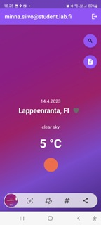
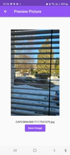
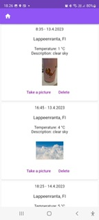

# Sääsovellus

Mobiilisovelluskehitys-kurssin harjoitustyö.

Käytetään OpenWeatherMap API:a säätietojen hakuun. Mahdollisuus tallentaa päiväkirjaan sääkortteja. Sääkortteihin saa lisättyä kuvia. Sovelluksessa käytetään hyödyksi puhelimen sijaintia sekä kameraa. Tallenukseen käytetty Firebasea. 

# Sovelluksen näkymät

*Tähän kuvat/kuvaukset näkymistä, esim. etusivu, päiväkirjasivu jne.*

Lähteenä käytetty: *Tähän linkit käytettyihin repositorioihin*

etusivu:

kirjautuminen:

kamera:

päiväkirja:

